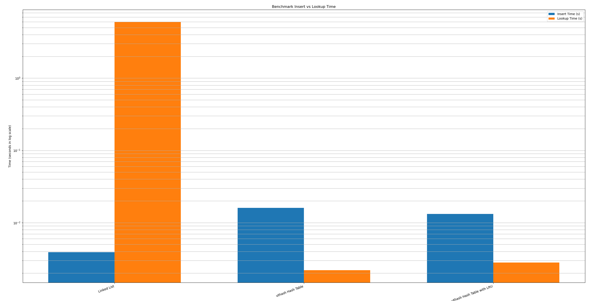
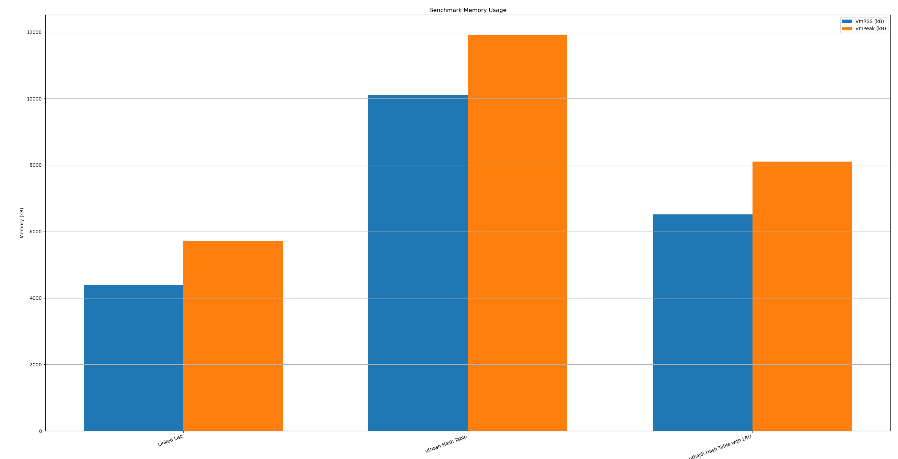
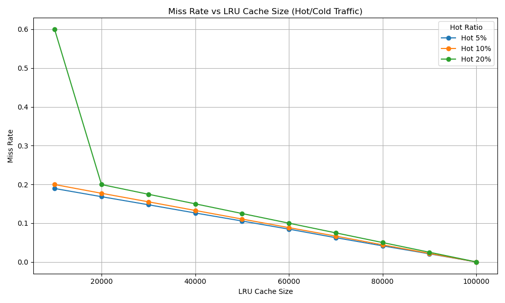

# mactab-bench

A simple benchmark project for evaluating different MAC address table implementations:

- **Linked List**: simple insertion and linear search
- **uthash Hash Table**: fast lookup
- **uthash + LRU + Aging**: fast lookup with memory management and automatic aging out

## Features

- Compare insertion and lookup performance
- Support Least Recently Used (LRU) eviction when MAC table is full
- Support aging timeout to automatically remove inactive entries
- Monitor memory usage (VmRSS and VmPeak)
- Visualize benchmark results using matplotlib

## Project Structure

```
mactab-bench/
├── benchmark.c 
├── list.h
├── list.c
├── hash.h
├── hash.c
├── ut_hash.h
├── Makefile
├── benchmark.csv (auto generated after run)
├── plot_benchmark.py (plotting script)
└── README.md 
```


## Build

Make sure you have `gcc` installed.

```bash
make
```

## Run Benchmark
```bash
./benchmark
```
It will generate a `benchmark.csv` file containing the performance results.

### Example output:
```
Name,Insert Time,Lookup Time,VmPeak(kB),VmRSS(kB)
Linked List,0.0031,5.4132,5724,4576
uthash Hash Table with LRU + Aging,0.0044,0.0037,15132,13928
```

## Plot Results

Install `matplotlib` if you have not:
```bash
pip install matplotlib
```
### Run
```
python3 plot_benchmark.py
```

### LRU size 50000





### Miss Rate vs LRU Cache Size under Hot/Cold Traffic
This experiment evaluates how the miss rate of a cache system changes with different LRU cache sizes under hot/cold traffic patterns.

It aims to show the relationship between cache capacity, traffic locality, and lookup success rate.

We test different `LRU cache sizes (10k–100k)` and `hot data ratios (5%, 10%, 20%)` to evaluate the `cache miss rate` under hot/cold traffic patterns.

The goal is to see how cache size and traffic locality affect system performance.



#### Results Summary
More hot data (20%) needs larger cache to keep miss rate low!

## Third-Party Code

This project includes [uthash](https://troydhanson.github.io/uthash/), a simple hash table library for C, under the BSD 2-clause license. The license notice is preserved in `ut_hash.h`.